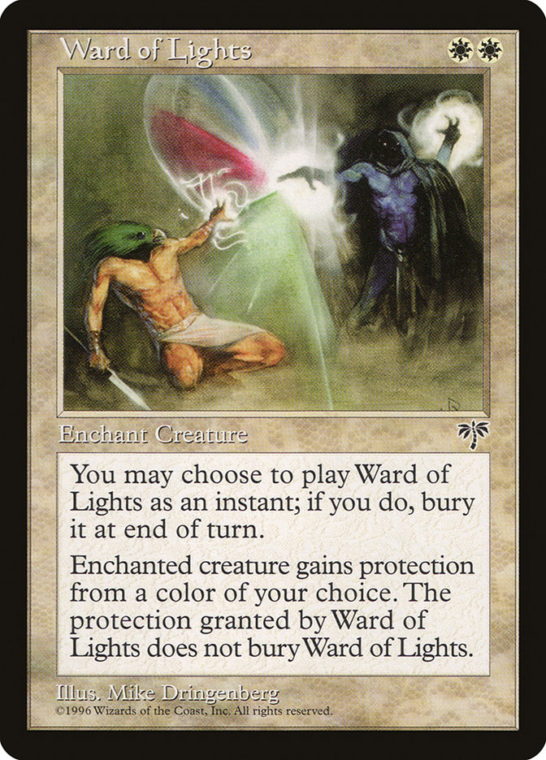
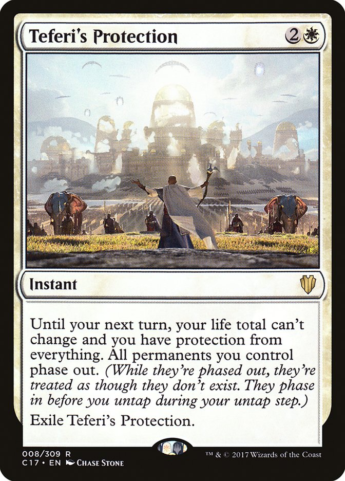

> _This article was first published on Scuttlebutt, republished here
> with a couple edits._

## What do you mean _warding_?

In the context of magic, a ward is a charm or enchantment, usually cast on a
place and set up to bar evil from entering, while letting the good pass freely.
I’m not sure where I picked this concept up, it’s quite likely playing Magic the
Gathering (which ironically enough is itself a ward).

One time a friend of mine threw a P-party (not the drug, like the letter P).
Being a contratrian who enjoys squirreling out edges cases, I went as a
Pterodactyl. My costume was hastily put together - I made a large cardboard mask
(masks and identity are another fascinating thread, but for another time),
didn’t have time for wings, so put on a suit, and tied a tie to my belt as a
tail. Come monday, my belt still had the tail, and I decided to skip figuring
out the knot and wear it to work (I was a highschool teacher at the time).

This was motivated by: laziness, enjoying attention, opportunity to
systematically break peoples models of me, and role modeling it being fine to be
a weirdo. I got reactions similar to what you experience if you’ve ever shaved
your head or similar - some people making a big deal of it, some people ignoring
it.

But there were nuances in there which were super instructive. Some people were
super judgey “why are you wearing a tail?” (said with a frown and concern). Wow,
that was an incredibly quick shortcut to learning you’re closed minded! Getting
to skip a bunch of pre-amble and have a conversation about what we really value
in people and society was super great. Or if the context wasn’t right, to just
laugh and walk the fuck away. For some people it surfaced insecurity. The
principle of the school (a 60 year old kinda old fashioned but kindly white
dude) approached me after a meeting one
day and said in an embarassed aside:

> “Huhuh, Mix I notice there are only two of us wearing ties, and I’m wearing
> mine around my neck and you’re wearing yours around your arse... I can’t
> help wondering if you’re mocking me!”.
>
> “Huhuh, yeah”, I said ambiguously.

I also attracted allies. One of the students who chose me as a mentor wore bunny
slippers everywhere (she was way ahead of me on being a delightful weirdo). At
one time we had a teddybear onsie which people casually wore around. One of my
parents turned up to a meeting - “I was at a fabric store the other day and they
had these fluffly offcuts, and I thought of you”, she said, holding up a furry
strip of fabric. So my tie tail got upgraded to a full on furry tail… why not I
guess?

## Fucking with gender as a ward

Living in an age where gender roles are really prescriptive really sucks. It’s
been really great to explore what not being what dominant culture might call
manly. What’s it like to be able to be vulnerable, try to understand your
feelings, and integrate that into your relationships? Pretty fucking great.

What’s it like to notice that all the mens clothes in a shop are boring, and buy
something ‘made for women’ which you feel great in? Excellent.

My friends and I are into really open communication, nail painting, and wearing
whatever. Mikey looks gorgeous in a dress. Here’s me rocking a gold lamé top I
found at my mother in laws place... I’m giving a talk at a JS conf in New Zealand.

## Nerddom as a ward

I play Magic the gathering. People have feelings and thoughts about this. Same
about Science Fiction. (Oh boy don’t get me started on talking to people who
enjoy ‘literature’ as higher form of writing and look down on sci-fi)

Solarpunk? Are you willing to engage with a genre which is optimistic and not
yet clearly defined?

Wear your nerddom like a badge, loudly, with pride. Great asshole detector, and
you’d be surprised how many nerds there are out there lurking.

   

## Magic/ mysticism as a ward

You might have seen some of the language of magic swirling around the
scuttleverse. I deliberatly discuss rituals, which I think of as ‘known
repeatable patterns which invite awareness, and weave bonds amongst us’.
Christian culture may have baked a distrust of ritual into your psyche, which is
pretty funny given how littered with ritual the church is. To be clear,
Thanksgiving, Mothers day, Birthday Parties, Show and tell, Checkin rounds,
Retrospectives are all powerful everyday rituals.

BUT, using more pagan language is a great ward, and it’s flavourful and fun!

Other magic to watch out for : #invocation, smudging, crystals, alchemy, sun and
moon apps, wizards (I told piet’s wedding he was a wizard - which I deifne as a
socially AND technically talented humyn)

This isn’t an accident. I find magic really deeply evocative and playful. And a
super effective ward - Zach! has a fantastic story I’d love to invite him to
share about running his Solarpunk Magic gatherings.

## Invoking a warding strategy

‘Ward’ might not be a perfect title because it more strongly represents guarding
than welcoming, which is a shame. Nevertheless I am inviting you to cast off and
ignore normative culture and proudly wear your marginalised culture, whatever it
is.

By making things which are purple, and have rainbows, by being cute, or nerdy, a
little bit magical, or a little bit dirty because you’re building a boat with
your hands, you’re representing that which you love.

If other people don’t think that’s scaleable, GOOD. Scaling is normative
capitalistic mindset and warding against that is a gift. It also means we’ll
spend more time meeting beautiful colourful humans who are curious and care
about others.
